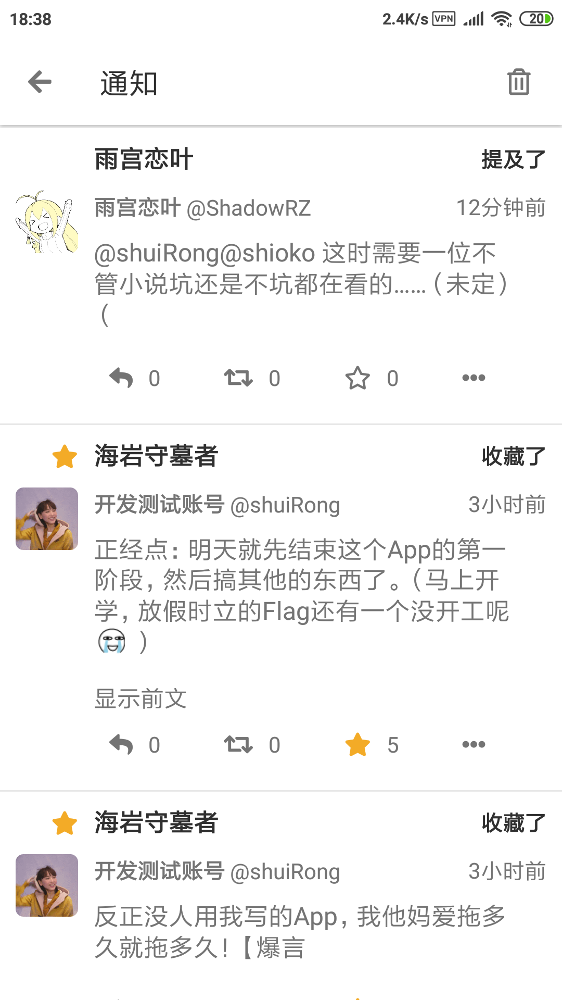
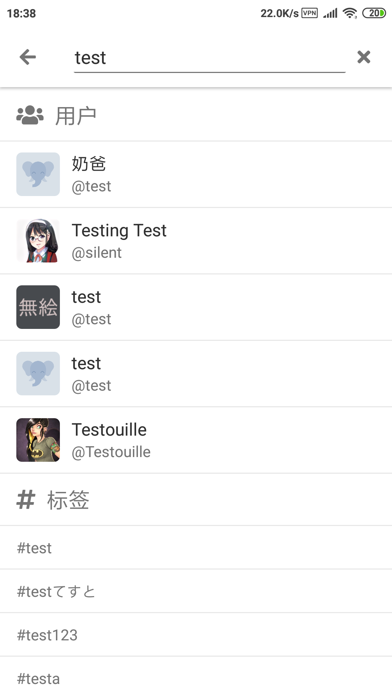

# Gakki

> This is a third-part client of [Mastodon](https://joinmastodon.org/) written by `React Native`（only Android is considered recently）.
>
> That's my  [Mastodon Account](https://cmx.im/web/accounts/81232), welcome to feedback. 

[中文](./README.ZH.md)

**[Download APK](https://github.com/shuiRong/Gakki/releases)**

> a series of development tutorials are being prepared.

**More Details is coming**


#### Getting Started：

---

**First of all**, You need to having required environment of `React Native` .（just Android） [Official Documentation](https://facebook.github.io/react-native/docs/getting-started).

**Download Project：**

```bash
git clone https://github.com/shuiRong/Gakki
cd ./Gakki
yarn // or npm i
```

**Create Local Config file**

create file in `src/utils/config.js`, it contains：

```javascript
export const token = 'Bearer xxxxxxxx'  // required. (Watch out: there is a blank space.)
export const deploymentKey = 'yyyyyyy'  // only required for production. CodePush deployment key. For more detail, see https://github.com/Microsoft/react-native-code-push
export const version = '1.0' // required. app version used in About.js
```

> How to get my token?
>
> 1. You need a mastodon account and then open your setting page. For example: https://cmx.im/settings/applications.
> 2. Create a new application in Development-->Yout applications.
> 3. set `Redirect URI` to `https://linshuirong.cn` this version temporarily (will be optimized in the next version).
> 4. select all Scopes.
> 5. click `Submit` button
>
> Click the Application you just created. You can see `Your access token`, that's it.


**Connect Phone:** connect your phone to the computer using USB. see [Offcial Documentation](https://facebook.github.io/react-native/docs/running-on-device) and Google your question. 

**Run Project:**

```bash
react-native run-android
```

P.S. You can find me [here](https://cmx.im/web/accounts/81232) if you have a problem with Gakki or submit an [issue](https://github.com/shuiRong/Gakki/issues). 

#### Page Preview

---
|  |  |  |
|-|-|-|
|     |      |      |
|      |      |       |
|      |      |      |
| | | |


#### Todo List

---

[Github Projects](https://github.com/shuiRong/Gakki/projects/2)
